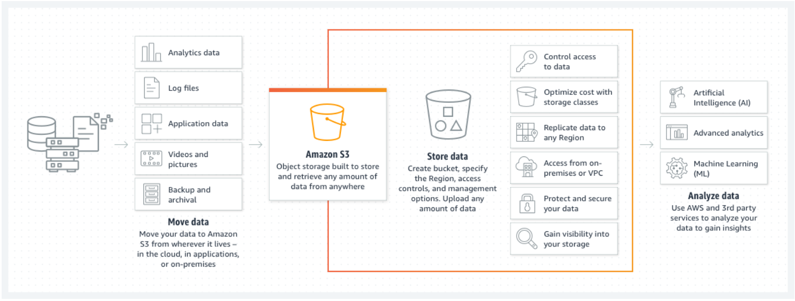

# AWS S3 and Lambda

## Amazon S3
Object storage built to retrieve any amount of data from anywhere.

### What is Amazon S3 ?
Amazon Simple Storage Service (Amazon S3) is an object storage service offering industry-leading scalability, data availability, security, and performance.

### Use Cases
- Build a data lake.
- Back up and restore critical data.
- Archive data at the lowest cost.
- Run cloud-native applications.

### Why to Use Amazon S3 ?
Customers of all sizes and industries can store and protect any amount of data for virtually any use case, such as data lakes, cloud-native applications, and mobile apps. 

With cost-effective storage classes and easy-to-use management features, you can optimize costs, organize data, and configure fine-tuned access controls to meet specific business, organizational, and compliance requirements.

## AWS Lambda Basics

### What is AWS Lambda ?
AWS Lambda is a **serverless** computing service provided by Amazon Web Services (AWS). Users of AWS Lambda create functions, self-contained applications written in one of the supported languages and runtimes, and upload them to AWS Lambda, which executes those functions in an efficient and flexible manner.

The concept of **serverless** computing refers to not needing to maintain your own servers to run these functions. 

### Use Cases 
- Scalable APIs. 
- Data processing. 

## Content Delivery Network (CDN)

### What is a CDN ?
A Content Delivery Network (CDN) is a geographically distributed group of servers that work together to provide fast delivery of Internet content. A CDN allows for the fast transfer of data needed for loading Internet content including HTML pages, javascript files, stylesheets, images, and videos.

### How does a CDN work with relation to the website visitor ?
CDNs work through servers nearest to the website visitor respond to the request. The content delivery network copies the pages of a website to a network of servers that are spread out at geographically different locations, caching the contents of the page. 

When a user requests a webpage that is part of a content delivery network, the CDN will redirect the request from the originating site’s server to a server in the CDN that is closest to the user and deliver the cached content. 

CDNs will also communicate with the originating server to deliver any content that has not been previously cached.

In turn, the speed is improved by distributing content closer to the website visitors by using a nearby CDN server, causing visitors to experience faster page loading times. 

### Why to Employ a CDN ?
Employing a CDN doesn’t only speed up the delivery of Internet content, it helps protect your website against certain forms of cyber attacks, such as Denial of Service attacks. It protects against these threats because CDNs allow for the handling of more traffic and withstanding hardware failure better than many origin servers. 

## References:

[AWS S3](https://aws.amazon.com/s3/)

[AWS Lambda Basics](https://www.serverless.com/aws-lambda)

[CDN](https://cyberhoot.com/cybrary/content-delivery-network-cdn/)

### [Home Page](./README.md)
