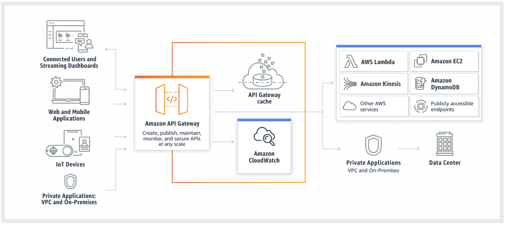

# AWS API, Dynamo and Lambda

## AWS API Gateway

### What is Amazon API Gateway ?
**Amazon API Gateway** is a managed service that allows developers to define the HTTP endpoints of a REST API or a WebSocket API and connect those endpoints with the corresponding backend business logic. It also handles authentication, access control, monitoring, and tracing of API requests.

### Why is Amazon API Gateway an important part of the Serverless ecosystem ?
Within the Serverless ecosystem, API Gateway is the piece that ties together Serverless functions and API definitions. Being able to trigger the execution of a Serverless function directly in response to an HTTP request is the key reason why API Gateway is so valuable in Serverless setups: it enables a truly serverless architecture for web applications. 

### How does API Gateway integrate with other AWS services ?
- Invoking an AWS Lambda function.
- Invoking another HTTP endpoint, with or without VPC Link.
- Making an HTTP call against the API of any AWS service that provides an HTTP API.
- Returning a mock response generated within API Gateway without calling out to other services.

### What are the some benefits of using Amazon API Gateway ?
- Efficient API development.
- Performance at any scale.
- Cost savings at scale.
- Easy monitoring.
- Flexible security controls.
- RESTful API options.

### What two API types might you choose from ?
1. RESTful APIs.
2. WEBSOCKET APIs.

### How API Gateway Works ?

## AWS DynamoDB

### What is DynamoDB ? 
**DynamoDB** is a hosted NoSQL database offered by Amazon Web Services (AWS). It offers:
- Reliable performance even as it scales.
- A managed experience, so you won't be SSH-ing into servers to upgrade the crypto libraries.
- A small, simple API allowing for simple key-value access as well as more advanced query patterns.

### DynamoDB is a particularly good fit for the following use cases:
- Applications with large amounts of data and strict latency requirements.
- Serverless applications using AWS Lambda.
- Data sets with simple, known access patterns.

### How DynamoDB works ?

### Use cases:
- Develop software applications.
- Create media metadata stores.
- Deliver seamless retail experiences.
- Scale gaming platforms.

## Dynamoose

### What is Dynamoose ?
**Dynamoose** is a modeling tool for Amazon's DynamoDB. **Dynamoose** is heavily inspired by Mongoose, which means if you are coming from Mongoose the syntax will be very familar.

### What are some key features of Dynamoose?
- Type safety.
- High level API.
- Easy to use syntax.
- Ability to transform data before saving or retrieving documents.
- Strict data modeling (validation, required attributes, and more).
- Support for DynamoDB Transactions.
- Powerful Conditional/Filtering Support.
- Callback & Promise support.

## Reference:

[AWS API Gateway Overview](https://www.serverless.com/guides/amazon-api-gateway)

[AWS API Gateway](https://aws.amazon.com/api-gateway/)

[AWS DynamoDB Guide](https://www.dynamodbguide.com/what-is-dynamo-db/)

[AWS DynamoDB](https://aws.amazon.com/dynamodb/)

[Dynamoose](https://www.serverless.com/guides/amazon-api-gateway)

### [Home Page](./README.md)
