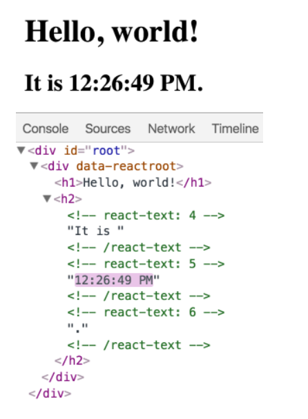

# Component Based UI

## React Hello World

### What are the building blocks of a React app?
- Elements.
- Components.

### What is the difference between an element and a React component?
*Elements* are the smallest building blocks of React apps.
*Components* let you split the UI into independent, reusable pieces, and think about each piece in isolation.

The simplest way to define a component is to write a JavaScript function:

```
function Welcome(props) {
  return <h1>Hello, {props.name}</h1>;
}
```

You can also use an **ES6 class** to define a component:

```
class Welcome extends React.Component {
  render() {
    return <h1>Hello, {this.props.name}</h1>;
  }
}
```
## Introducing JSX

```
const element = <h1>Hello, world!</h1>;
```

It is called JSX, and it is a syntax extension to JavaScript. We recommend using it with React to describe what the UI should look like. JSX may remind you of a template language, but it comes with the full power of JavaScript.

### Why JSX?
React doesn’t require using JSX, but most people find it helpful as a visual aid when working with UI inside the JavaScript code. It also allows React to show more useful error and warning messages.

### Embedding Expressions in JSX
In the example below, we declare a variable called name and then use it inside JSX by wrapping it in curly braces:

```
const name = 'Josh Perez';
const element = <h1>Hello, {name}</h1>;
```

You can put any valid JavaScript expression inside the curly braces in JSX. For example, `2 + 2`, `user.firstName`, or `formatName(user)` are all valid JavaScript expressions.

```
function formatName(user) {
  return user.firstName + ' ' + user.lastName;
}

const user = {
  firstName: 'Harper',
  lastName: 'Perez'
};

const element = (
  <h1>
    Hello, {formatName(user)}!
  </h1>
);
```

### JSX Prevents Injection Attacks
It is *safe* to embed user input in JSX:

```
const title = response.potentiallyMaliciousInput;
// This is safe:
const element = <h1>{title}</h1>;
```

By default, React DOM escapes any values embedded in JSX before rendering them. Thus it ensures that you can never inject anything that’s not explicitly written in your application. Everything is converted to a string before being rendered. This helps prevent XSS (cross-site-scripting) attacks.

## Rendering Elements

### How is the UI updated?
The only way to update the UI is to create a new element, and pass it to `root.render()`.
Consider this ticking clock example:

```
const root = ReactDOM.createRoot(
  document.getElementById('root')
);

function tick() {
  const element = (
    <div>
      <h1>Hello, world!</h1>
      <h2>It is {new Date().toLocaleTimeString()}.</h2>
    </div>
  );
  root.render(element);
}

setInterval(tick, 1000);
```

### If changes are made to the UI, what does React update?
React Only Updates What’s Necessary.

React DOM compares the element and its children to the previous one, and only applies the DOM updates necessary to bring the DOM to the desired state.

You can verify by inspecting the last example with the browser tools:



## References:

[React Hello World](https://reactjs.org/docs/hello-world.html)

[Introducing JSX](https://reactjs.org/docs/introducing-jsx.html)

[Rendering Elements](https://reactjs.org/docs/rendering-elements.html)

### [Home Page](./README.md)
