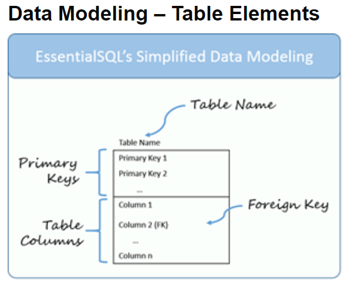

# Data Modeling

## NoSQL VS SQL
| SQL                                           | NoSQL                                                                          |
| -----------                                   | -----------                                                                    |
| Relational Databases                          | Non-Relational or Distributed Database                                         |
| Table based databases                         | document based, key-value pairs, graph databases or wide-column stores.        |
| Predefined schema                             | dynamic schema                                                                 |
| Vertically scalable                           | Horizontally scalable                                                          |
| Uses SQL (Structured Query Language)          | Using UnQL (Unsructured Query Language)                                        |
| Examples: MySql, Oracle, Sqlite, Postgres and MS-SQL. | Examples: MongoDB, BigTable, Redis, RavenDb, Cassandra, Hbase, Neo4j and CouchDb  |

### For complex queries:
- SQL: Good fit for the complex query intensive environment.
- NoSQL: Not good fit for complex queries.
### For the type of data to be stored:
- SQL: Not best fit for hierarchical data storage.
- NoSQL: Fits better for the hierarchical data storage.
### For scalability:
- SQL: SQL databases are vertically scalable. You can manage increasing load by increasing the CPU, RAM, SSD, etc, on a single server.
- NoSQL: NoSQL databases are horizontally scalable. You can just add few more servers easily in your NoSQL database infrastructure to handle the large traffic.
### For high transactional based application:
- SQL: The best fit for heavy duty transactional type applications.
- NoSQL: used for transactions purpose, it is still not comparable and sable enough in high load and for complex transactional applications.
### For support:
- SQL: Excellent support are available for all SQL database from their vendors. 
- NoSQL: For some NoSQL database you still have to rely on community support, and only limited outside experts are available for you to setup and deploy your large scale NoSQL deployments.
### For properties:
- SQL: Emphasizes on ACID properties ( Atomicity, Consistency, Isolation and Durability). 
- NoSQL: Follows the Brewers CAP theorem ( Consistency, Availability and Partition tolerance ).
### For DB types: 
- SQL: we can classify SQL databases as either open-source or close-sourced from commercial vendors. 
- NoSQL: can be classified on the basis of way of storing data as graph databases, key-value store databases, document store databases, column store database and XML databases.

## SQL Database Examples
1. MySQL Community Edition.
2. MS-SQL Server Express Edition.
3. Oracle Express Edition.

## NoSQL Database Examples
1. MongoDB.
2. CouchDB.
3. Redis.

## Data Modeling – Table Elements 

### Notes:
#### A table typically has one primary key, but can have more.  
#### When the key has more than one column, it is called a `compound key`.
#### Foreign Key >> This is a column or set of columns which match a primary key in another table.

## Data Modeling – Table Relationships

### Notes:
#### In some cases an entry in one table can be related to more than one entry in another. 
#### This is called a one-to-many relationship.
#### n our example there are many employees in on department `many-to-one` relationship >> `one-to-many`.

## Relations

[Home Page](./README.md)