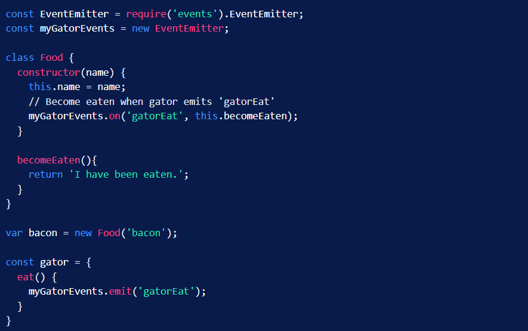

# Event-Driven Programming in Node.js
Event-Driven Programming is a logical pattern that we can choose to confine our programming within to avoid issues of complexity and collision.

### Event-Driven Programming makes use of the following concepts:
- An Event Handler is a `callback function` that will be called when an event is triggered.
- A Main Loop listens for event triggers and calls the associated event handler for that event.

## Node.js and Event-Driven Programming
Node.js natively provides us with a useful module called **EventEmitter** that allows us to get started incorporating Event-Driven Programming in our project right away.

## How to Create a New EventEmitter Object ?

>> const EventEmitter = require('events').EventEmitter;
>>
>> const myEventEmitter = new EventEmitter;

### Chat room example: alert everyone when a new user joins the chat room:

>> const EventEmitter = require('events').EventEmitter;
>>
>> const chatRoomEvents = new EventEmitter;
>>
>> function userJoined(username){
>>
>>  // Assuming we already have a function to alert all users.
>>
>>  alertAllUsers('User ' + username + ' has joined the chat.');
>>
>> }
>>
>> // Run the userJoined function when a 'userJoined' event is triggered.
>>
>> chatRoomEvents.on('userJoined', userJoined);

**EventEmitter** has an emit method that we we use to trigger the event. We would want to trigger this event from within a login function inside of our chatroom module.

>> function login(username){
>>
>>  chatRoomEvents.emit('userJoined', username);
>>
>> }

## How to Remove Listeners ?
Why to remove a listener ?
- Performance reasons.
- Avoid memory leaks.

To remove event listeners in EventEmitter we can use the `removeListener` or `removeAllListeners` method.

### Example:

>> const EventEmitter = require('events').EventEmitter;
>>
>> const chatRoomEvents = new EventEmitter;
>>
>> function displayMessage(message){
>>  
>>  document.write(message);
>>
>> }
>>
>> function userJoined(username){
>>  
>>  chatRoomEvents.on('message', displayMessage);
>>
>> }
>>
>> chatRoomEvents.on('userJoined', userJoined);
>> 
>> //To remove displayMessage function from the message event’s list of handlers
>> 
>> chatRoomEvents.removeListener('message', displayMessage);

## Object Oriented Programming with Event-Driven Programming

## [Event - Node.js v18.4.0 Cheat Sheet](https://nodejs.org/api/events.html)

## References:
[Event-Driven Programming in Node.js](https://www.digitalocean.com/community/tutorials/nodejs-event-driven-programming)

### [Home Page](./README.md)
