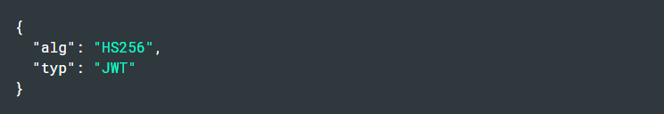
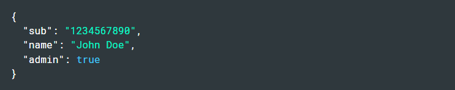
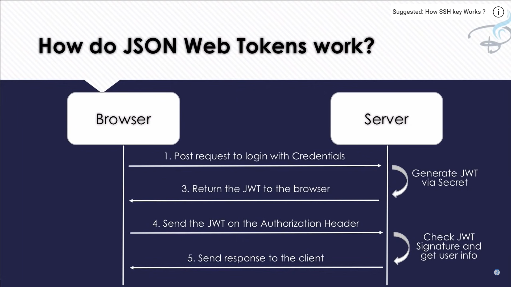

# JSON Web Token (JWT)

## What is JSON Web Token?
- It is an open standard.
- Securely transfer information between any two bodies (users).
- Digitally signed >> Information is verified and trusted.

### Compact
- JWT can be sent via URL, POST request and HTTP headers.
- Fast transmission.

### Self-contained
- Contains information about the user.
- Avoiding query the database more than once.

## When to use?
- Authorization
- Information Exchange

## JWT Structure
- Header: `x`
- Payload: `y`
- Signature: `z`

`xxxxx.yyyyy.zzzzz`

### Header
Two parts:
- Type of the token.
- Signing algorithm being used, such as HMAC SHA256 or RSA.

### Payload
Conatains `claims`: Claims are statements about an entity (typically, the user) and additional data.
Types of claims:
- Registered claims.
- Public claims.
- Private claims.

### Signature
To create the signature part you have to take the encoded header, the encoded payload, a secret, the algorithm specified in the header, and sign that.

For example if you want to use the HMAC SHA256 algorithm, the signature will be created in the following way:

### Combine all to form JWT

## How do JWT work?

