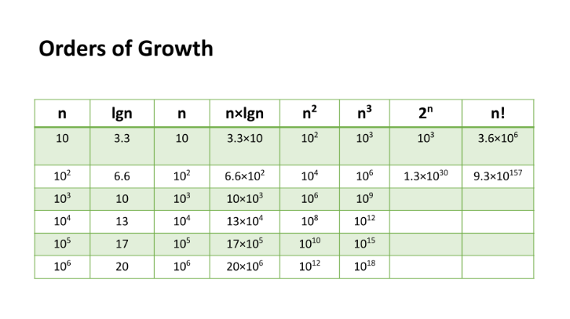

# Linked Lists

## Big O
### What is Big O ?
It's a notation used to describe The worst case analysis of an algorithm or function based on 2 factors:
- Running Time: How much time the function/algorithm needs?
- Memory Space: How much space the function/algorithm needs to store its data and instructions.

### How to find Big O ?
We have 4 keys areas for analysis:
- Input Size: The size of the parameter values that are read by the algorithm. (n) Higher n >> More likely higher running time and memory space.
- Units of Measurement: millisecodns and number of operations for running time factor and the amount of space needed for input, output, code and working area for space factor.
- Orders of Growth: 

### Summery of Big O
The worst case: The efficiency for the worst possible input of size n.

## What is a Linked List
A Linked List is a sequence of Nodes that are connected/linked to each other. The most defining feature of a Linked List is that each Node references the next Node in the link.

### Types of Linked Lists:
- Singly: Singly refers to the number of references the node A has. A Singly linked list means that there is only one reference, and the reference points to the Next node in a linked list.
- Doubly: Doubly refers to there being two (double) references within the node. A Doubly linked list means that there is a reference to both the Next and Previous node.
- Multiply Linked List: In a multiply linked list, each node consists of two or more link fields. Each field is used to join the same set of records in a different order of the same set.
- Circular Linked List: Is a little odd in that it doesn’t end with a node pointing to a null value. Instead, it has a node that acts as the tail of the list (rather than the conventional head node), and the node after the tail node is the beginning of the list. 

### Important Notes of Linked Lists:
#### The best way to traverse through a linked list is by using (while()) loop.
#### Traversing linked list has Big O of time = O(n) and Big O of space = O(1).
#### Adding Nodes can be done in the begining of the linked list with `Add()` method and in the middle of it by `AddBefor()`or `AddAfter()` methods.
#### Linked lists can be linear structured (traversed sequentially) and non-linear structured (traversed non-sequentially).
#### Linked lists don't need to be continuous in memory(as arrays), they can grow dynamically.
#### Parts of linked lists: Head(starting point) and the end of the list isn’t a node, but rather a node that points to null, or an empty value.
#### Each single node must have two element:
- `DATA`: The information that the node contains.
- `NEXT`: reference to the next node.
#### The main properties of a linked list data structure are:
- `SIZE`: The number of elements in the linked list.
- `HEAD`: The first element in the linked list.
- `TAIL`: The last element in the linked list.
#### The main operations of a linked list data structure are:
- `insertAt`: Inserts an element at the specific index.
- `removeAt`: Removes the element at the specific index.
- `getAt`: Retrieves the element at the specific index.
- `clear`: Empties the linked list.
- `reverse`: Reverses the order of elements in the linked list.

[Home Page](./README.md)

