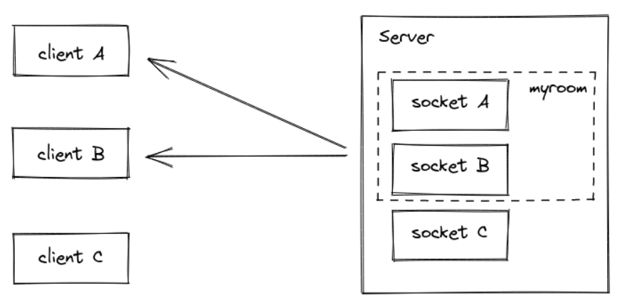
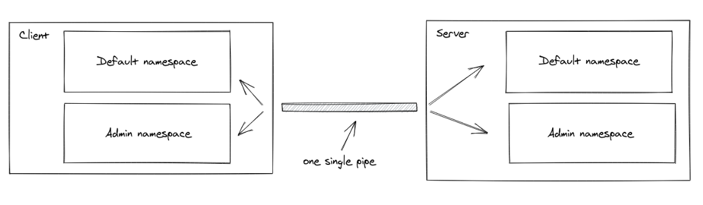

# Message Queues

## [Socket.io Chat Example](https://socket.io/get-started/chat/) 
In this example, a basic chat application is created where there is a bi-directional communication channel between a client and a server. 

**Broadcasting** is for us to emit the event from the server to the rest of the users. `io.emit('someEvent',payload)`.

To send a message to everyone *except* for a certain emitting socket, we have the `broadcast` flag for emitting from that socket:
```
io.on('connection', (socket) => {
  socket.broadcast.emit('hi');
});
```

## Rooms
A **room** is an arbitrary channel that sockets can `join` and `leave`. It can be used to broadcast events to a subset of clients:



### To join a room: `join()`
```
io.on("connection", (socket) => {
  socket.join("some room");
});
```
### Emitting/Broadcasting: `to`/`in`
```
io.to("some room").emit("some event");
```
Or from a given socket:
```
io.on("connection", (socket) => {
  socket.to("some room").emit("some event");
});
```

### To leave a room: `leave()` just like `join()`.

### Private messages: based on `SocketID`
```
io.on("connection", (socket) => {
  socket.on("private message", (anotherSocketId, msg) => {
    socket.to(anotherSocketId).emit("private message", socket.id, msg);
  });
});
```

#### [More about implementation details](https://socket.io/docs/v4/rooms#implementation-details)

## Namespaces
A *Namespace* is a communication channel that allows you to split the logic of your application over a single shared connection (also called "*multiplexing*").



### Each namespace has its own:
- Event handlers.
- Rooms.
- Middlewares.

### Main namespace is: `/` 
`io.emit("hello");` is actually equivalent to `io.of("/").emit("hello");`.
`io.sockets` is an alias for `io.of("/")`.

### Multiplexing will be disabled in the following cases:
- Multiple creation for the same namespace.
```
const socket1 = io();
const socket2 = io(); // no multiplexing, two distinct WebSocket connections
```
- Different domains.
```
const socket1 = io("https://first.example.com");
const socket2 = io("https://second.example.com"); // no multiplexing, two distinct WebSocket connections
```
- Usage of the forceNew option
```
const socket1 = io();
const socket2 = io("/admin", { forceNew: true }); // no multiplexing, two distinct WebSocket connections
```

### Dynamic namespaces
```
io.of(/^\/dynamic-\d+$/);
```

Existing namespaces have priority *over* dynamic namespaces.

#### The return value of the `of()` method is what we call the *parent namespace*, from which you can:
- Register middlewares.
```
const parentNamespace = io.of(/^\/dynamic-\d+$/);
parentNamespace.use((socket, next) => { next() });
```
- Broadcast events.
```
const parentNamespace = io.of(/^\/dynamic-\d+$/);
parentNamespace.emit("hello"); // will be sent to users in /dynamic-1, /dynamic-2, ...
```

## References:

[Socket.io Chat Example](https://socket.io/get-started/chat/)

[Rooms](https://socket.io/docs/v4/rooms)

[Namespaces](https://socket.io/docs/v4/namespaces/)


### [Home Page](./README.md)
