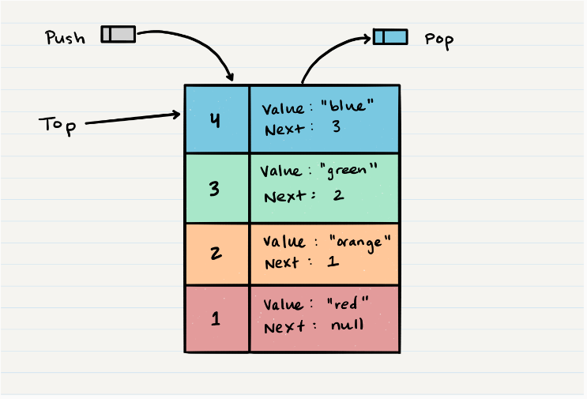
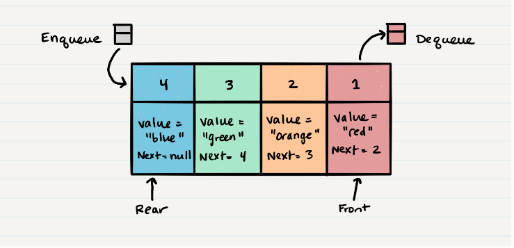

# Stacks and Queues

## What is a Stack ?

A **stack** is a data structure that consists of Nodes. Each Node references the next Node in the stack, but does not reference its previous.

>> FILO
>>
>> LIFO

### Common terminology for a stack

- `Push`: Put nodes into the stack. O(1)

>> ALOGORITHM push(value)
>>
>> node = new Node(value)
>>
>> node.next <-- Top
>>
>> top <-- Node

- `Pop`: Remove nodes from the stack. O(1)

>> ALGORITHM pop()
>>
>> Node temp <-- top
>>
>> top <-- top.next
>>
>> temp.next <-- null
>>
>> return temp.value
>>
>> //Pop an empty stack >> exception will be raised.

- `Top`: This is the top of the stack.

- `Peek`: View the value of the top Node in the stack. O(1)

>> ALGORITHM peek()
>>
>> return top.value
>>
>> //Peek an empty stack >> exception will be raised.

- `IsEmpty`: Returns true when stack is empty otherwise returns false. O(1)

>> ALGORITHM isEmpty()
>>
>> return top = NULL

## What is a Queue ?

>> FIFO
>>
>> LILO

### Common terminology for a queue

- `Enqueue` - Nodes or items that are added to the queue. O(1)

>> ALGORITHM enqueue(value)
>>
>> node = new Node(value)
>>
>> rear.next <-- node
>>
>> rear <-- node

- `Dequeue` - Nodes or items that are removed from the queue. O(1)

>> ALGORITHM dequeue()
>>
>> Node temp <-- front
>>
>> front <-- front.next
>>
>> temp.next <-- null
>>
>> return temp.value
>>
>> //If called when the queue is empty >> exception will be raised.

- `Front` - This is the front/first Node of the queue.

- `Rear` - This is the rear/last Node of the queue.

- `Peek` - When you peek you will view the value of the front Node in the queue. O(1)

>> ALGORITHM peek()
>>
>> return front.value
>>
>> //If called when the queue is empty >> exception will be raised.

- `IsEmpty` - Returns true when queue is empty otherwise returns false. O(1)

>> ALGORITHM isEmpty()
>>
>> return front = NULL

## References:
[Stacks and Queues](https://codefellows.github.io/common_curriculum/data_structures_and_algorithms/Code_401/class-10/resources/stacks_and_queues.html)

### [Home Page](./README.md)

