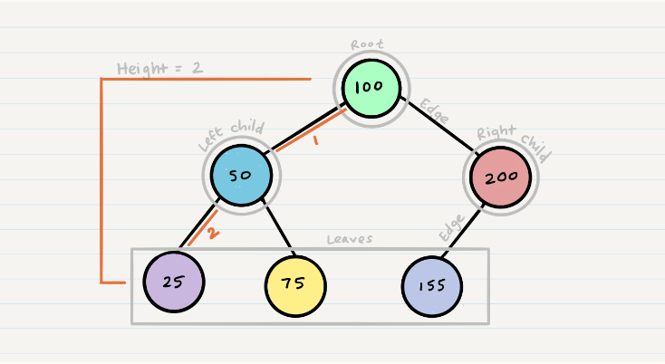
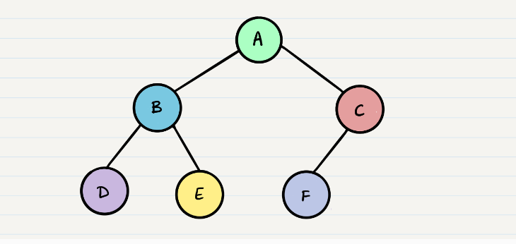
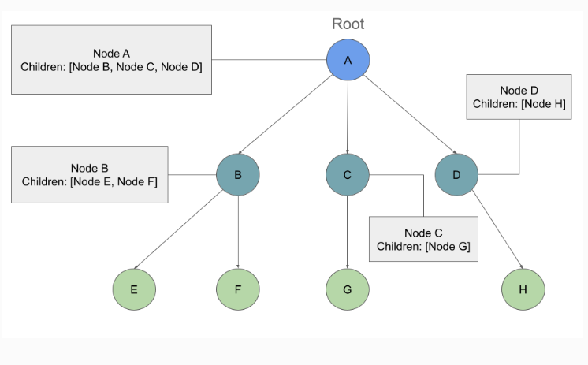
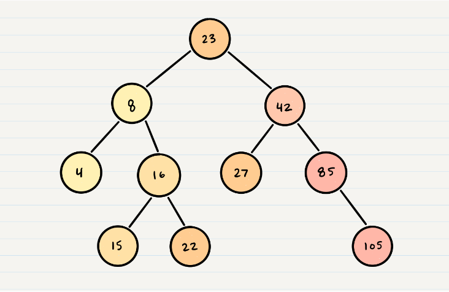
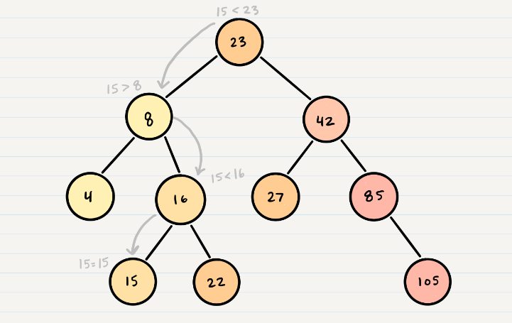

# Trees

- **Binary Trees**.
- **Binary Search Trees**.
- **K-ary Trees**.


## Common Terminology



`K` : A number that specifies the maximum number of children any node may have in a `k-ary tree`. In a `binary tree`, k = 2.

`Left` and `Right` are in `binary trees`.


## How to Traverse Trees ?
Two categories of traversals when it comes to trees:

### 1. Depth First 

Methods for depth first traversal:

- **Pre-order**: `root >> left >> right`.

```
ALGORITHM preOrder(root)
// INPUT <-- root node
// OUTPUT <-- pre-order output of tree node's values

  OUTPUT <-- root.value

  if root.left is not NULL
      preOrder(root.left)

  if root.right is not NULL
      preOrder(root.right)

```

- **In-order**: `left >> root >> right`.

```
ALGORITHM inOrder(root)
// INPUT <-- root node
// OUTPUT <-- in-order output of tree node's values

    if root.left is not NULL
        inOrder(root.left)

    OUTPUT <-- root.value

    if root.right is not NULL
        inOrder(root.right)

```

- **Post-order**: `left >> right >> root`.

```
ALGORITHM postOrder(root)
// INPUT <-- root node
// OUTPUT <-- post-order output of tree node's values

    if root.left is not NULL
        postOrder(root.left)

    if root.right is not NULL
        postOrder(root.right)

    OUTPUT <-- root.value

```

#### Example:



- Pre-order: `A, B, D, E, C, F`.
- In-order: `D, B, E, A, F, C`.
- Post-order: `D, E, B, F, C, A`.

### 2. Breadth First

```
ALGORITHM breadthFirst(root)
// INPUT  <-- root node
// OUTPUT <-- front node of queue to console

  Queue breadth <-- new Queue()
  breadth.enqueue(root)

  while ! breadth.is_empty()
    node front = breadth.dequeue()
    OUTPUT <-- front.value

    if front.left is not NULL
      breadth.enqueue(front.left)

    if front.right is not NULL
      breadth.enqueue(front.right)

```

#### Example:
For the example of Depth First, the output using Breadth First will be: `A, B, C, D, E, F`.

## Binary Tree Vs K-ary Trees
**K-ary Trees**: Can have any number of children per node.
**Binary Trees**: Restrict the number of children to two as tree in previous example.

### K-ary Trees
#### How to traverse K-ary Trees ?
It's like breadth first traversal, but we are now moving down a list of children of length k, instead of checking for the presence of a left and a right child.

```
ALGORITHM breadthFirst(root)
// INPUT  <-- root node
// OUTPUT <-- front node of queue to console

  Queue breadth <-- new Queue()
  breadth.enqueue(root)

  while ! breadth.is_empty()
    node front = breadth.dequeue()
    OUTPUT <-- front.value

    for child in front.children
        breadth.enqueue(child)

```

#### Example:



Output: `A, B, C, D, E, F, G, H`

#### Adding a Node
- Traverse (Breadth First Traverse).
- Find the first node that does not have all its children filled.
- Insert the new node as a child.
- Fill the child slots from left to right.

It takes O(n) as time complexity because of traversing through nodes and O(w) as space complexity where w is the largest width of the tree.

## Binary Search Trees (BST)
In a **BST**, nodes are organized in a manner where all values that are smaller than the `root` are placed to the left, and all values that are larger than the `root` are placed to the right.



### Searching a BST:



Time complexity is O(h) where h is the hieght of the tree >> O(log(n)) and space complexity is O(1), no need for extra spaces.