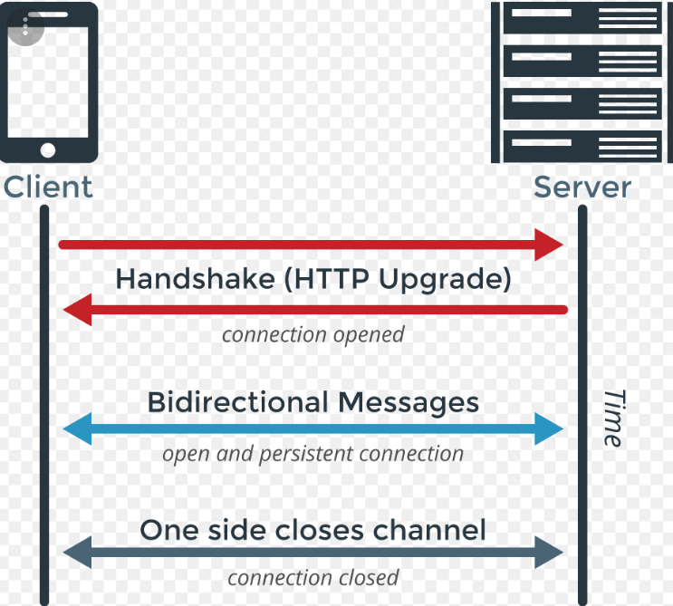
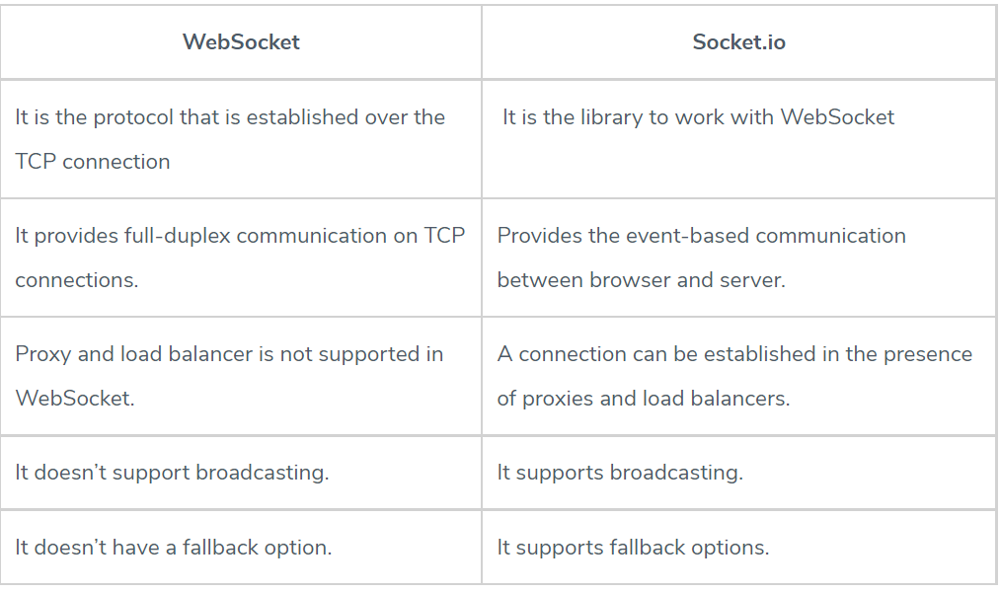

# Socket.io

## What is a Web Socket?
**WebSocket** is a computer communications protocol, providing full-duplex communication channels over a single TCP connection.

**WebSocket** is distinct from HTTP.

The **WebSocket** protocol enables interaction between a web browser (or other client application) and a web server with lower overhead than half-duplex alternatives such as *HTTP polling*, facilitating real-time data transfer from and to the server.

The **WebSocket** protocol specification defines `ws` (WebSocket) and `wss` (WebSocket Secure) as two new uniform resource identifier (URI) schemes that are used for `unencrypted` and `encrypted` connections respectively.

## Web Socket Request/Response Handshake
To establish a WebSocket connection, the client sends a WebSocket handshake request, for which the server returns a WebSocket handshake response as shown in picture below:



## Socket.IO Tutorial
Socket.IO enables real-time bidirectional event-based communication. It works on every platform, browser or device, focusing equally on reliability and speed.

Sockets work based on *events*. These are some reserved events, which can be accessed using the socket object on the **server-side**:
- `Connect`
- `Message`
- `Disconnect`
- `Reconnect`
- `Ping`
- `Join` 
- `Leave`

The **client-side** socket object also provides us with some reserved events:
- `Connect`
- `Connect_error`
- `Connect_timeout`
- `Reconnect`, etc.

### Socket.io Example:
In the *Hello World* example, we used the connection and disconnection events to
log when a user connected and left.

```
require('express')();
var http = require('http').Server(app);
var io = require('socket.io')(http);

app.get('/', function(req, res){
   res.sendFile('E:/test/index.html');
});
 
io.on('connection', function(socket){
   console.log('A user connected');
 
   // Send a message after a timeout of 4seconds
   setTimeout(function(){
      socket.send('Sent a message 4seconds after connection!');
   }, 4000);
   socket.on('disconnect', function () {
      console.log('A user disconnected');
   });
});
http.listen(3000, function(){
   console.log('listening on *:3000');
});
```

*Four* seconds after the client connects, **send** function on socket object will associates the '*message*' event. To handle this event on client side use this code in *index.html* file:
```
<!DOCTYPE html>
<html>
   <head><title>Hello world</title></head>
   <script src="/socket.io/socket.io.js"></script>
   <script>
      var socket = io();
      socket.on('message', function(data){document.write(data)});
   </script>
   <body>Hello world</body>
</html>
```
#### Notes:
- Client and server can emit custom events: `socket.emit('someEvent',{//details as an object})`. This event **someEvent** needs a listener, if it was in server we need in client this code to listen and handle it: `socket.on('someEvent',handleSomeEventFunction)`.

- To broadcast an event from server-side: 
```
var io = require('socket.io')(http);
io.sockets.emit('broadcast',{ description: clients + ' clients connected!'});
```
- To send an event to everyone, but the client that caused it: 
```
socket.emit('newclientconnect',{ description: 'Hey, welcome!'}); //this for the user who caused the event
socket.broadcast.emit('newclientconnect',{ description: clients + ' clients connected!'}) //this for all other users except the one who caused it.
```

## Logging & Debugging
### Server-side
`DEBUG=* node app.js`

### Client-side
`localStorage.debug = '*';`
To limit the output to get the debug info with incoming data from the socket:
`localStorage.debug = 'socket.io-client:socket';`

## [Chat Application Example](https://www.tutorialspoint.com/socket.io/socket.io_chat_application.htm)

## WebSocket vs Socket.io



### Key Differences between WebSocket and socket.io
- WebSocket provides the Connection over TCP, while Socket.io is a library to abstract the WebSocket connections.
- WebSocket doesn’t have fallback options, while Socket.io supports fallback.
- WebSocket is the technology, while Socket.io is a library for WebSockets.


## References:

[Web Sockets](https://en.wikipedia.org/wiki/WebSocket)

[Socket.io Tutorial](https://www.tutorialspoint.com/socket.io/)

[Socket.io vs Web Sockets](https://www.educba.com/websocket-vs-socket-io/)


### [Home Page](./README.md)
